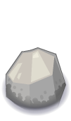
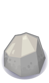
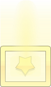
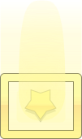

# Planet Cute tileset

Copy of the Planet Cute tileset [created by Daniel Cook][source].

The main reason for this repository is that it includes vector SVG files
exported from the original design document. It also includes one PNG file
that was missing on the source page.

The image files are optimized for file size, PNGs using `kraken.io` and
SVG using `svgo`.

[source]: https://lostgarden.home.blog/2007/05/12/dancs-miraculously-flexible-game-prototyping-tiles/

| Tile | PNG | SVG |
| ---- | --- | --- |
|Brown Block|||
|Character Boy|||
|Character Bunny Girl|||
|Character Cat Girl|||
|Character Horn Girl|||
|Character Pink Girl|||
|Character Princess Girl|||
|Chest Closed|||
|Chest Lid|||
|Chest Open|||
|Dirt Block|||
|Door Tall Closed|||
|Door Tall Open|||
|Enemy Bug|||
|Gem Blue|||
|Gem Green|||
|Gem Orange|||
|Grass Block|||
|Heart|||
|Key|||
|Plain Block|||
|Ramp East|||
|Ramp North|||
|Ramp South|||
|Ramp West|||
|Rock|||
|Roof East|||
|Roof North East|||
|Roof North West|||
|Roof North|||
|Roof South East|||
|Roof South West|||
|Roof South|||
|Roof West|||
|Selector|||
|Shadow East|||
|Shadow North East|||
|Shadow North West|||
|Shadow North|||
|Shadow Side West|||
|Shadow South East|||
|Shadow South West|||
|Shadow South|||
|Shadow West|||
|Speech Bubble|||
|Star|||
|Stone Block Tall|||
|Stone Block|||
|Tree Short|||
|Tree Tall|||
|Tree Ugly|||
|Wall Block Tall|||
|Wall Block|||
|Water Block|||
|Window Tall|||
|Wood Block|||

---
Additional information about shadows:

* [Mockup](png/PlanetCuteShadowMockup.jpg)
* [Instruction](png/PlanetCuteShadowTest.png)
